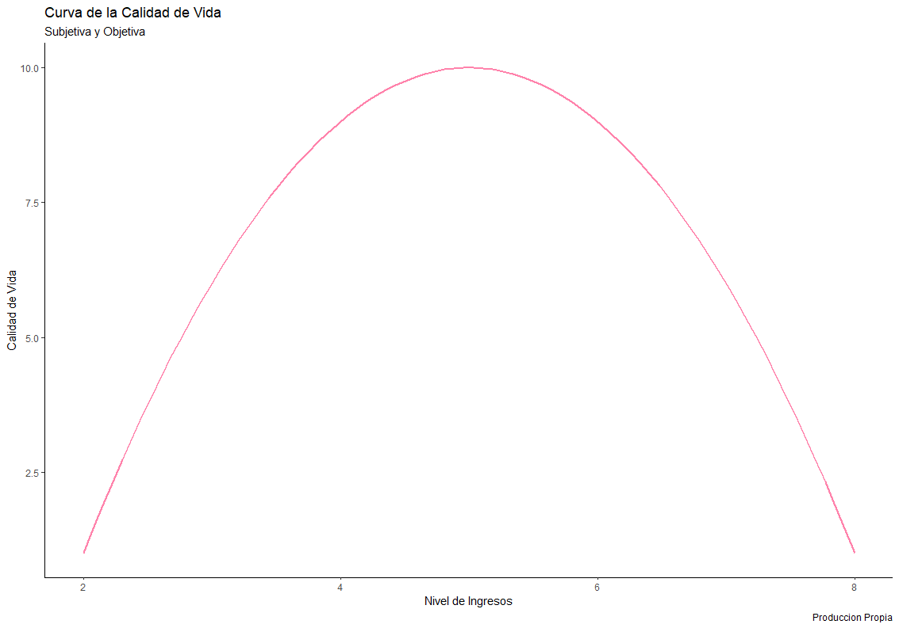

## Resumen

En la medición de la calidad de vida, la economía ha tenido en cuenta las variables de longevidad, escolaridad e ingreso. Sin embargo, los largos confinamientos y la pandemia del SARSCOV-2 nos han mostrado que el cuidado de la salud mental es esencial para el mantenimiento de relaciones sociales y del bienestar individual. Por lo cual este documento construye el Índice Humano de Salud Mental (IHSM) una medición subjetiva de calidad de vida que usa principalmente los reportes de enfermedades mentales. Por último, se analizan las relaciones entre la desigualdad, corrupción, desarrollo y los rubros del gasto público. Obteniendo resultados contraintuitivos a nivel agregado, que se pueden explicar por sesgos en la recolección de datos y de variables omitidas.

**Palabras clave:** salud mental, felicidad, desarrollo, bienestar, capacidad Estatal y desigualdad.

**JEL:** C13, D63, I31, I1, J68

## Abstract

In measuring the quality of life, the economics have kept in mind the longevity, scholarship, and income. However, the long confinements and the pandemic SARSCOV-2 have shown to us that mental health care is essential to maintain social relationships and individual welfare. Therefore, this document builds the Human Index of Mental Health (IHSM) a subjective measurement for quality of life. It mainly uses the reported cases of mental diseases. Finally, the relationships among inequality, corruption, level of development and amounts of public expenditure. The results obtained were counterintuitive at the aggregate level, it can be explained by biases in data collection and omitted variables.

**Keywords:** Mental Health, happiness, development, welfare, state capacity and inequality.

**JEL:** C13, D63, I31, I1, J68

## Introduccion

"No es humillante ser infeliz. El sufrimiento físico a veces es humillante, pero el sufrimiento del ser no puede ser, es la vida" (Albert Camus, 1964).

Anteriormente era un tabú hablar de la salud mental en nuestros hogares e incluso en claustros de las academias, por lo que sólo se le reservo espacio en centros hospitalarios y en las facultades de psicología y medicina. En contra de ello, este trabajo abre un espacio desde la perspectiva económica, postulando el Índice Humano de Salud Mental (IHSM) como una noción del nivel de calidad de vida enfocada en el estado psicológico de una sociedad, para luego, encontrar relaciones causales que determinen como la intervención estatal de algunos países pueden mejorar o deteriorar la salud mental.

En este orden de ideas, se desarrolla la siguiente pregunta de investigación ¿Cómo medir la calidad de vida de una sociedad tomando como eje principal el estado de salud mental de su población? La respuesta a ello resulta relevante ahora más que nunca, porque en los últimos acontecimientos como la pandemia y la crisis económica este tema ha alcanzado el centro de la problemática pública. Donde, hemos aprendido que sin un buen cuidado de nuestra salud mental se deterioran las condiciones de calidad de vida a partir del fin de relaciones humanas necesarias para nuestra supervivencia.

Asimismo, hoy estos problemas son más visibles y afectan desigualmente a toda la población, con diferente magnitud según sea la edad. En particular, las generaciones más jóvenes poseen una de las mayores tasas de mortalidad relacionadas a problemas de salud mental, lo que ha convertido al suicidio como la tercera causa de muerte entre poblaciones de 15 a 19 años según la OMS (2019). Mientras que, las personas de mediana edad poseen una tasa de 16.17 suicidios por cada 100.000 habitantes del mundo para 2017 (Our World in Data, 2017), siendo la segunda más alta por edades después de los mayores de 70.

Por estos motivos, resulta pertinente el uso de políticas públicas que diseñen estrategias focalizadas, en las variables que posean un mayor impacto sobre la reducción de enfermedades psicológicas. Se analiza si las herramientas de gasto público pueden mejorar la calidad de vida y evitar el deterioro de la pandemia de salud mental que sería costoso y difícil de manejar en las décadas venideras. Asimismo, se analiza las relaciones entre el nivel de desarrollo, la corrupción y la desigualdad con la estabilidad mental, medida por el IHSM, esperando que mejores niveles de desarrollo reduzcan los reportes de salud mental, mientras que incrementos de corrupción y desigualdad los incrementen.

El desarrollo de este índice subjetivo trae de primera mano resultados algo abstractos, ya que es una medida más cercana a la felicidad y al bienestar social que la dada por la teoría económica clásica. De modo que resuelve parcialmente como medir la calidad de vida según el estado de salud mental. En base a mantener controladas y en descenso las enfermedades mentales traduciéndose en una vida más digna, por ende, más feliz. Dejando solo un problema, el que los índices que constituyen el IHSM no tomen en cuenta a los individuos que poseen varias de estas enfermedades respecto a su población.

De esta manera, en la primera sección se sintetiza el estado del arte, donde se analiza la literatura de lo entendido por calidad de vida y salud mental. En la segunda se abarca el análisis de datos, sus características y las fuentes de estos. En la tercera se construye el IHSM con las variables de enfermedades mentales. Luego en la cuarta se establece la metodología para estimar el efecto del Estado sobre el IHSM, este efecto Estado se desagrega en el desarrollo, corrupción, desigualdad y gasto público en grandes rasgos. Por último, se exhiben los resultados y conclusiones del estudio.

## 1. Estado del Arte

El análisis de la calidad de vida normalmente tiene dos vertientes, una dada por la economía donde se busca la medición objetiva y otra por parte de las ciencias sociales -dirigidas por la psicología cuando se habla de salud mental- que la asocian a condiciones subjetivas. Estableciendo una especie de discusión de dos frentes académicos en disenso. Con una de las partes considerando el aumento de la renta y las oportunidades para la mejora de la movilidad social, como el esquema del desarrollo y el mejoramiento de la calidad de vida. En cambio, la otra usa una parametrización más cercana a la medición de la "felicidad" y el bienestar subjetivo (BS).

Sin embargo, estas dos realidades académicas no persisten en la sociedad. Es simple, una mayor renta y desarrollo social objetivo no son suficientes, el ser humano necesita tener condiciones de BS para no encontrarse en panoramas de deterioro en su salud mental, que finalicen en el suicido o en la perdida de sí mismos. Por lo que autores como Argyle cree necesario el uso de mediciones basadas en tres condiciones primordiales de BS la "(1) satisfacción, (2) la frecuente experiencia de estados emocionales positivos y (3) la ausencia de depresión u otros estados negativos" (1993). Las cuales contrasta con las relaciones sociales, el ocio y el trabajo para encontrar que tan "felices" son las personas y por lo tanto cuan buena es su calidad de vida.

La conclusión a la cual llega Argyle (1993) es que personas con buenas relaciones sociales, actividades de ocio asociadas con la salud física y trabajos acordes a sus gustos son más "felices" al tener menores tendencias de trastornos mentales, por lo tanto, una mejor calidad de vida. Pero no es el único panorama que el informe toca, se habla también de una medida objetiva que afecta subjetivamente la "felicidad", como lo es la salud física. En lo cual argumenta que su mal estado puede repercutir en el deterioro de la salud mental, pero condicionado a la personalidad, ya que esta hace que el ser humano sea más o menos resiliente a sus enfermedades.

Así mismo la literatura empírica permite comprobar el efecto de la salud física sobre el BS. Perez et al. (2014) en ese ámbito dispone de un análisis que explica como la salud fisca se deteriora desigualmente entre países desarrollados y en vía de desarrollo durante las crisis económicas, generando problemas de malnutrición, pobreza energética y mala salud mental.

No obstante, este tipo de investigaciones posee problemas en su capacidad de capturar el deterioro psicológico de las sociedades, debido a que los datos se cruzan con tasas de suicidio y los indicadores de servicios sociales. Que, si bien son aproximaciones de los efectos en "felicidad" y el papel del Estado sobre esta, no corrigen los posibles errores de recolección de datos y la pésima concepción de que el suicidio es signo de mala salud mental -relativamente cierto en muchos casos-. Porque el suicidio como tal es una decisión que dependerá del contexto en el cual se toma y no solo del estado mental de la persona. Como solución a la problemática el IHSM podría servir como un mejor proxy del BS social, ya que no depende del contexto sino de las enfermedades mentales.

Pero aun así existen investigadores que tratan de corregir el problema de los datos como Evans et al. (2006), los cuales plantean que los trastornos mentales afectan la calidad de vida, basándose en como variaban las oportunidades según el grupo de personas a el cual se pertenece en el Reino Unido, que son: enfermedad mental severa (EMS), trastorno mental común (TMC) y sin trastorno (ST). El resultado es inesperado, con observaciones de múltiples errores, esto debido a que se concluye que la calidad de vida de los EMS es mejor que la del resto de grupos. Explicando que esto se debe a la existencia de sesgos subjetivos al hacer el análisis, pues su propia condición interna en los grupos influye al evaluar las oportunidades que tienen a futuro. Concluyendo que los estudios de calidad de vida que combinan muestreos de salud mental deben controlar los indicadores con los que se miden las variables para evitar caer en sesgos subjetivos.

Otra investigación por el estilo de Evans et al. (2006) aborda de nuevo el BS, pero especificando la definición de Schalock (citador por Martín & Verdugo, 2002), que establece la calidad de vida más aceptada por la comunidad científica, la cual considera el bienestar emocional, relaciones interpersonales, bienestar material, desarrollo personal, bienestar físico, autodeterminación, inclusión social y derechos humanos. Encontrando que al incrementar la participación del paciente en su tratamiento mejora sus condiciones de vida, lo que implica que los servicios sociales con mayores enfoques en autodeterminación son esenciales para disminuir las enfermedades mentales. Dando relevancia a la necesidad de investigar con herramientas precisas como el IHSM para la implementación, vigilancia y aplicación de políticas sociales -en este caso de salud pública-.

La necesidad de la intervención estatal por lo tanto resuena para resolver la situación de salud mental actual y como su no existencia o mal uso puede terminar afectando la calidad de vida, por la falta de prevención y cuidado de enfermedades mentales. No obstante, se debe tener cuidado al hablar de este tema usualmente tabú en la sociedad, porque muchos concluirán que la problemática solo representa a una parte de la población, por lo que la solución es cuidarlos a ellos o no hacer absolutamente nada \<\<igual solo afecta a unos pocos\>\>.

Esta constante de poca visibilidad del debate de salud mental en la sociedad que se traslapa a la economía se pretende desarrolla con el IHSM, porque es necesario entenderla como una problemática pública que afecta la calidad de vida. Bien decía Argyle (1993), la renta no es lo único para ser "felices". Y sí la medición de la calidad de vida no toma en cuenta el BS, pues no se está midiendo correctamente. Entonces, para esto debemos considerar los mejores caminos que permitan la creación de herramientas como los índices compuestos, si se pretende crear una medición útil para el debate o la implementación de políticas públicas. En este camino la CEPAL (Schuschny & Soto,2009) mediante su **Guía metodológica Diseño de indicadores compuestos de desarrollo sostenible**, presta las herramientas necesarias para la creación de lo que probablemente será el primer indicador que mide la calidad de vida de forma subjetiva y objetiva.

La metodología presentada por el organismo consiste en:

i.  desarrollo de un marco conceptual: el cual analiza la relevancia de las variables, trata de explicar porque son importantes para el indicador y que consideraciones se están tomando para argumentar que esto es un componente primordial de lo que se mide;

ii. selección de los indicadores: es una vertiente del marco conceptual pero que se enfoca en la elección de subindicadores basado en la relevancia, calidad, frecuencia y la disponibilidad al dominio público;

iii. análisis multivariado: es un paso esencial por la estadística para determinar la importancia de las variables a utilizar, ya no solo en términos conceptuales sino aplicando algunos análisis matemáticos de relación entre los subíndices;

iv. imputación de datos perdidos: se plantean diferentes metodologías para encontrar datos faltantes o la eliminación de filas que no afecten de forma contundente el proceso de creación del indicador, pero que permita su eficaz realización;

v.  normalización de datos: es un proceso por el cual se busca que todas las variables queden en una única taxonomía para que los procesos de agregación sean posibles, por ejemplo, tener variables de PIB y porcentaje de población, eso no se puede usar si no se normaliza para crear el indicador;

vi. ponderación de la información: busca asignar los pesos de las variables según se considere bajo una visión cualitativa de preguntar a expertos, con el uso de elementos estadísticos o una combinación de estas;

vii. agregación de la información: es el punto culmine del proceso donde se crea el índice como tal, en este se explican los diferentes métodos para agregar sus bondades y sus deficiencias;

y viii. análisis de robustez y sensibilidad: donde se trata de calibrar el indicador con el fin de comprobar que es útil y mide correctamente el concepto objetivo.

Bajo estos parámetros, junto a los aportes de los diferentes estudios analizados se conjugan las consideraciones de literatura que permiten identificar la relevancia de la calidad de vida subjetiva. Que no solo es primordial en un año que vive una doble pandemia por el Covid-19 y las enfermedades de salud mental, sino que resaltara un camino más humano hacía el futuro.

## 2. Datos

Las bases de datos usadas para la creacion del IHSM y las respectivas regresiones relacionadas al papel de los Estados en la calidad de vida subjetiva son de Our World in Data, DatosMacro y Banco Mundial. DatosMacro tiene como principal fuente las oficinas estadisticas nacionales de cada país y bancos centrales, por otro lado, el Banco Mundial recolecta los datos de manera independiente. Por último las bases de Our World in data corresponden a un compilado de las fuentes, Institute of Health Metrics and Evaluation (IHME), Global Burden of Disease (GBD), World Health Organization (WHO) International Classification of Diseases (ICD) y Global Health Observatory (GHO). Se tiene como principal objeto de analisis 185 países. Para resolver el primer objetivo de esta inevestigacion que es la construcción del IHSM, se usan 7 variables y 5180 observaciones. El segundo, la de las regreciones, tiene el IHSM y 6 variables más con 5180 observaciones. Ambas son longitudinales abarcando el periodo de 1990 hasta 2017.

### 2.1. Datos de las Estimaciones

La primera estimación será el impacto de la politica fiscal sobre el IHSM y la segunda, el impacto del nivel de desarrollo, corrupción y desigualdad sobre el mismo índice. A continuación describimos las variables usadas (Tabla 1) y estadisticas descritivas respecto a cada regrecion.

***Tabla 1 - Descripción de las Variables***

+----------------------------------+--------------------------------+-----------------------------------------------------------------------------------------------------------------------------------------------------------------------------------------------------------------------------------------------------------+
| **Variable**s para la estimación | **Nombre**                     | Descripción                                                                                                                                                                                                                                               |
+==================================+================================+:==========================================================================================================================================================================================================================================================+
| IDH                              | Índice de desarrollo humano    | Es un indicador del desarrollo humano de un país, hecho por el Programa de las Naciones Unidas para el Desarrollo. El cual analiza la evolución de dimensiones esenciales para el ser humano como la educación, los años de vida y el ingreso per cápita. |
+----------------------------------+--------------------------------+-----------------------------------------------------------------------------------------------------------------------------------------------------------------------------------------------------------------------------------------------------------+
| GPS                              | Gasto público en salud         | Es el gasto publico por concepto de salud medido como porcentaje respecto al PIB.                                                                                                                                                                         |
+----------------------------------+--------------------------------+-----------------------------------------------------------------------------------------------------------------------------------------------------------------------------------------------------------------------------------------------------------+
| GPE                              | Gasto público en educación     | Es el gasto publico por concepto de educación medido como porcentaje respecto al PIB.                                                                                                                                                                     |
+----------------------------------+--------------------------------+-----------------------------------------------------------------------------------------------------------------------------------------------------------------------------------------------------------------------------------------------------------+
| GPD                              | Gasto público en defensa       | Es el gasto publico por concepto de defensa medido como porcentaje respecto al PIB.                                                                                                                                                                       |
+----------------------------------+--------------------------------+-----------------------------------------------------------------------------------------------------------------------------------------------------------------------------------------------------------------------------------------------------------+
| IC                               | Índice de corrupción           | Es el índice de percepción de la corrupción elaborado por la Organización de Transparencia Internacional. Donde cero es una percepción alta de corrupción y 100 corresponde a lo contrario.                                                               |
+----------------------------------+--------------------------------+-----------------------------------------------------------------------------------------------------------------------------------------------------------------------------------------------------------------------------------------------------------+
| GINId                            | Gini después de transferencias | Mide como es la distribución de ingresos después de impuestos. Este va de 0 a 1 entre más alto más desigualdad hay en el país.                                                                                                                            |
+----------------------------------+--------------------------------+-----------------------------------------------------------------------------------------------------------------------------------------------------------------------------------------------------------------------------------------------------------+
| IHSM                             | Índice humano de salud mental  | Es el índice de medición de la calidad de vida subjetiva, creado para fines investigativos de este documento. Este va de 0 a 100, entre mayor sea la puntuación menor es la calidad de vida subjetiva en el país.                                         |
+----------------------------------+--------------------------------+-----------------------------------------------------------------------------------------------------------------------------------------------------------------------------------------------------------------------------------------------------------+

: Construcción propia

#### 2.1.1. Politica Fiscal en el IHSM

La primera regresión planteada usa los rubros del gasto público (efecto Estado) para explicar el IHSM, estos son el gasto público en salud, el gasto público en educación y el gasto público en defensa. Cada variable está en porcentaje respecto al PIB según sea el país, lo que permite su comparabilidad y uso para hacer estimaciones. La Tabla 2 muestra las estadísticas descriptivas de las principales variables explicativas, donde se observan tendencias a tener en cuenta como en el GPD, el cual posee un valor máximo que se considera Outliers al generar ruido dentro de los datos, lo cual afecta la media hacia arriba y distorsiona la desviación estándar quedando en 299.820 puntos porcentuales. Por lo que para evitar errores en los cálculos se decide no tomar en cuenta ese dato.

***Tabla 2 - Estadísticas Descriptivas Politica Fiscal***

+----------+-------+-----------+---------------+------------+-------------+-------------+------------+
| Variable | N     | Media (%) | Desviación.St | Minimo (%) | Pctl(25)(%) | Pctl(75)(%) | Máximo (%) |
+==========+=======+===========+===============+============+=============+=============+============+
| GPS      | 4,077 | 8.319     | 5.016         | 0.550      | 4.330       | 11.600      | 42.050     |
+----------+-------+-----------+---------------+------------+-------------+-------------+------------+
| GPE      | 4,265 | 4.525     | 3.222         | 0.570      | 2.990       | 5.430       | 44.330     |
+----------+-------+-----------+---------------+------------+-------------+-------------+------------+
| GPD      | 4,055 | 7.208     | 299.820       | 0.000      | 1.130       | 2.750       | 19,093.450 |
+----------+-------+-----------+---------------+------------+-------------+-------------+------------+

: Fuente Datos: Datosmacro

#### 2.1.2. Desarrollo, desigualdad y corrupción en el IHSM

En este caso se estima el efecto del desarrollo, la desigualdad y la percepcion de corrupcion sobre el IHSM, lo que permite entender como la situacion economica e institucional (corrupcion) afectan la calidad de vida subjetiva de un país. Los datos son indicadores producidos por organizaciones multilaterales y ONGs. En la Tabla 3 se muestran las estadísticas descriptivas de las variables explicativas con información que permite entender el estado actual del mundo, por ejemplo, en promedio los países tienen un IDH de 66.033 una situación alentadora comparándolo con el mínimo de 19.200. EL GINId por su parte es en promedio 38.749 lo que significa un bajo grado de desigualdad mundial después de transferencias. Pero este valor puede tener problemas, ya que, el mínimo es de 22.900 y esto puedo reducir fuertemente la media, sí se tiene en cuenta que estos valores hacen referencia a países que no poseen una gran cantidad de población, lo cual no representa el panorama mundial.

***Tabla 3 - Estadísticas Descriptivas Desarrollo, Desigualdad y Corrupción***

+----------+-------+--------+---------------+--------+----------+----------+---------+
| Variable | N     | Media  | Desviación.St | Minimo | Pctl(25) | Pctl(75) | Máximo  |
+==========+=======+========+===============+========+==========+==========+=========+
| IDH      | 4,354 | 66.033 | 16.521        | 19.200 | 53.400   | 78.700   | 95.400  |
+----------+-------+--------+---------------+--------+----------+----------+---------+
| IC       | 2,933 | 42.714 | 22.006        | 4.000  | 26.000   | 56.000   | 100.000 |
+----------+-------+--------+---------------+--------+----------+----------+---------+
| GINId    | 1,502 | 38.749 | 9.118         | 22.900 | 31.700   | 45.100   | 65.800  |
+----------+-------+--------+---------------+--------+----------+----------+---------+

#### 2.1.3. Construcción IHSM

Acorde a la primera pregunta de investigación las variables de la Tabla 4 son los elementos para la construcción del IHSM. Adicionalmente se toma en cuenta la tasa de suicidios que funciona como variable control en cada regresión, debido a que esta afecta directa e indirectamente los estados emocionales de las personas y por lo tanto es esencial para explicar la variable dependiente.

***Tabla 4 - Descripción e Importancia de los Sub-Ídices***

+---------------+----------------------+----------------------------------------------------------------------------------------------------------------------------------------------------------------------------------------------------------------------------------------------------------------------------------------------------------------------------------------------------------------------------------------------------------------------------------------------------------------------+
| **Variable**s | Nombre (per capita)  | Descripción e Importancia                                                                                                                                                                                                                                                                                                                                                                                                                                            |
+===============+======================+======================================================================================================================================================================================================================================================================================================================================================================================================================================================================+
| ANS           | Ansiedad             | Es la prevalencia de trastornos de ansiedad, la cual esta estandarizada por edad y género. Medida como un porcentaje con respecto a la población total. Puede deteriorar la calidad de vida de las personas que la padecen debido a que es un estado patológico de miedo, temor e inquietud, perdiendo su característica adaptativa para entrar a interrumpir decisiones del día a día. Con la posibilidad de terminar en enfermedades mentales mucho más complejas. |
+---------------+----------------------+----------------------------------------------------------------------------------------------------------------------------------------------------------------------------------------------------------------------------------------------------------------------------------------------------------------------------------------------------------------------------------------------------------------------------------------------------------------------+
| DP            | Depresión            | Prevalencia de trastornos depresivos. Esta estandarizada por edad y género. Medida como un porcentaje con respecto a la población total. Considerada como un estado de tristeza profunda y prolongada (no es solo sentirse triste) que es capaz de acarrear pensamientos suicidas de autodesprecio o pérdida del sentido en el yo, por lo que padecerla disminuye fuertemente el BS.                                                                                 |
+---------------+----------------------+----------------------------------------------------------------------------------------------------------------------------------------------------------------------------------------------------------------------------------------------------------------------------------------------------------------------------------------------------------------------------------------------------------------------------------------------------------------------+
| ESQ           | Esquizofrenia        | Prevalencia de esquizofrenia. Esta estandarizada por edad y género. Medida como un porcentaje con respecto a la población total. Es una enfermedad cerebral grave, que hace difícil para la persona que la padece mantener un trabajo o cuidar de sí mismo. Por lo que una sociedad con altas tasas de esta se enfrenta a proporcionar calidad de vida a una población que no es capaz de responder por si misma a sus necesidades.                                  |
+---------------+----------------------+----------------------------------------------------------------------------------------------------------------------------------------------------------------------------------------------------------------------------------------------------------------------------------------------------------------------------------------------------------------------------------------------------------------------------------------------------------------------+
| BI            | Bipolaridad          | Prevalencia del trastorno bipolar. Esta estandarizada por edad y género. Medida como un porcentaje con respecto a la población total. La cual provoca cambios de ánimo intensos que afectan por episodios maniacos, depresivos u mixtos a quien la padece. Lo cual produce cambios de comportamiento, bajo niveles de energía y es considerada también como un estado negativo perjudicial para el BS.                                                               |
+---------------+----------------------+----------------------------------------------------------------------------------------------------------------------------------------------------------------------------------------------------------------------------------------------------------------------------------------------------------------------------------------------------------------------------------------------------------------------------------------------------------------------+
| DA            | Desorden alimenticio | Prevalencia de trastornos alimenticios. Esta estandarizada por edad y género. Medida como un porcentaje con respecto a la población total. El padecer de uno de los trastornos alimenticios como la anorexia o la bulimia, afecta la autoimagen, las relaciones familiares y la salud física. Elementos esenciales para mantener una calidad de vida subjetiva alta.                                                                                                 |
+---------------+----------------------+----------------------------------------------------------------------------------------------------------------------------------------------------------------------------------------------------------------------------------------------------------------------------------------------------------------------------------------------------------------------------------------------------------------------------------------------------------------------+
| AH            | Alcoholismo          | Consumo total de alcohol. Medida en litros de alcohol puro, estimaciones proyectadas mayores de 15 años. El consumo excesivo de alcohol puede causar, suicidio y enfermedades físicas como cáncer al igual que afecta las relaciones familiares, de amigos y de trabajo, suponiendo un grave deterioro del BS.                                                                                                                                                       |
+---------------+----------------------+----------------------------------------------------------------------------------------------------------------------------------------------------------------------------------------------------------------------------------------------------------------------------------------------------------------------------------------------------------------------------------------------------------------------------------------------------------------------+
| DR            | Drogadicción         | Cualquier trastorno mental por uso de sustancias. Esta estandarizada por edad y género. Medida como un porcentaje con respecto a la población total. El consumo abusivo de sustancias psicoactivas puede causar, suicidio y enfermedades físicas, al igual que afecta las relaciones familiares, de amigos y de trabajo, suponiendo un grave deterioro del BS.                                                                                                       |
+---------------+----------------------+----------------------------------------------------------------------------------------------------------------------------------------------------------------------------------------------------------------------------------------------------------------------------------------------------------------------------------------------------------------------------------------------------------------------------------------------------------------------+
| SU            | Suicidios            | Muertes causadas por el suicidio por cada 100.000 habitantes. El acto de quitarse la vida no solo afecta al actor y víctima del hecho, sino que deja efectos duraderos en la familia, amigos y comunidades. Esta tendencia de ciclo autodestructivo social es relevante para controlar los efectos de otras variables en los sub-índices expuestos.                                                                                                                  |
+---------------+----------------------+----------------------------------------------------------------------------------------------------------------------------------------------------------------------------------------------------------------------------------------------------------------------------------------------------------------------------------------------------------------------------------------------------------------------------------------------------------------------+

: Construccion propia a partir de MedlinePlus y Argyle (1993)

Las estadísticas descriptivas de las variables en la Tabla 4 se encuentran en la Tabla 3 de anexos debido a que no son variables explicativas de las regresiones y funcionan para la construcción del IHSM o como variable control. Lo importante a tener en cuenta para la lectura del IHSM son los altos índices de DR (en promedio 12.95 % de la población la padecen) en el planeta respecto a los demás sub-índices, por lo que esta variable es decisiva para establecer que calidad de vida subjetiva posee un país.

### 2.2. Índice Humano de Salud Mental

Para crear el Índice Humano de Salud Mental se utilizan las herramientas ofrecidas por la **Guía metodológica Diseño de indicadores compuestos de desarrollo sostenible de la CEPAL** (Schuschny & Soto,2009). Por lo que se dispondrán tres títulos donde se agrupan las ocho etapas recomendadas por el documento (la conceptual está integrada en el titulo 3. Construcción IHSM de la anterior sección). Un cuarto título de este apartado expondrá las estadísticas descriptivas del índice en su versión base y ajustada.

#### 2.2.1. Análisis Multivariado

Se busca argumentar la utilidad de las variables usando métodos estadísticos que comprueben la necesidad de usarlas, o también observar que variables ya se encuentran representadas evitando problemas de colinealidad. En este trabajo se usará el método de los coeficientes *Alfa de Cronbach (1951)* que determina la consistencia interna, ósea mide cuan bien están representada la información de múltiples variables en el índice. Aquí mostramos la ecuación que permite calibrar cuales variables generan un buen coeficiente alfa, eliminando las variables del sistema una a una y viendo cómo se comporta. Se considera consistente si es el alfa es mayor a 0,70.

$$
\alpha = \frac{v}{v-1}(\frac{\sigma^2_I-\sum_{i=1}^{v}\sigma^2_{x
_i}}{\sigma^2_I})
$$

Donde:

$v$ = Numero de Variables

$\sigma_{x_i}^2$ = Varianza de cada uno de las variables

$\sigma_I^2$= Varianza del índicador

Según esta prueba y la importancia conceptual de cada sub-índice la mejor forma de construir el IHSM es usando la Ansiedad (ANS), la Depresión (DP), la Drogadicción (DR), la Bipolaridad (BI) y el Alcoholismo (AH). El proceso de selección se encuentra alojado en los Anexos título 2, donde se expone que, al usar las variables dichas, el alfa de Cronbach es de 0.7133786 lo que permite una consistencia aceptable. A su vez se señala que se escogió este conglomerado por encima de otros que daban un mejor alfa, ya que, conceptualmente la BI -que genera menor correlación entre las varianzas- afecta el BS debido a su condición de estado negativo y dificultad para permitir frecuentes estados saludables de felicidad.

#### 2.2.2. Normalización, Imputaciónde Datos y Ponderacion de la Informacion

Se imputan los datos, para que los países puedan tener IHSMs en los mismos periodos y de la mejor fiabilidad, esto significa que se usa un método para rellenar los datos faltantes o eliminarlos. Por las restricciones que impone la base se implementa el método de selección de entradas, donde se usa el valor anterior o posterior de las variables, pero solo con los datos del país, claramente esto implica algunas críticas, ya que la variabilidad queda sesgada. Además, por la naturaleza del método se borran selecciones que no tienen entradas (la metodología y los resultados se encuentra en el titulo 2 de anexos).

En segunda instancia se busca normalizar las variables para que se puedan contrastar, esto significa colocar todos los sub-índices bajo los mismos parámetros de decisión o la misma medida. El método usado en esta ocasión es el reescalamiento de cada una de las variables, como se muestra en la ecuación (1).

$$
y_{t}^i = \frac{x_{t}^i-min(x_{t_0}^i)}{max(x_{t_0}^i)-min(x_{t_0}^i)}*100 
$$(1)

Donde se usa el máximo y mínimo valor de cada variable con respecto a un año base, que en esta ocasión será 1990, para poder tener trazabilidad de la evolución del indicador en el tiempo. Los valores y los cálculos que permitieron esta normalización se encuentran alojados en los anexos.

Finalmente, se presenta la ponderación de la información, que busca darle pesos a cada una de las variables asignadas dependiendo de criterios matemáticos, bayesianos o simplemente igualitarios. En este caso se usará el método de pesos equiproporcionales, el mismo con el cual se crea el Índice de Desarrollo Humano, donde se supone que cada uno de los sub-índices son igualmente prioritarios. Para el IHSM la ponderación queda con pesos de $1/5$ debido a que son 5 variables según el Alfa de Cronbach las necesarias para la existencia de consistencia.

#### 2.2.3. Agrupación

En esta sección se plantea el método de agrupación lineal normalmente utilizado en índices compuestos como el IDH. La ecuación (2) muestra la agrupación lineal para la creación del IHSM cada año y para cada país. Para una mejor lectura de la información el resultado de este índice se multiplica por 100. Lo que significa que 0 es un buen estado de salud mental nacional o una calidad de vida subjetiva alta, por el contrario 100 es una calidad de vida subjetiva baja (en anexos se encuentra el codigo usado para la agrupación).

$$
IHSM_i = \sum_{j=1}^{t}w_{i}*x_{i}
$$(2)

Donde:

$IHSM_i$ = Índice Humano de Salud Mental de cada país

$w_i$ = Ponderador equiproporcional

$x_i$ = Valor normalizado de cada varible segun el país

Debido a que existen dudas claras en la recolección de datos de salud mental, por tabús culturales y religiosos, sistemas de información que no son capaces de recolectar datos por falta de recursos o sesgos por ideología y un largo etcétera de dificultades, se plantea un IHSM ajustado. El cual usa el reescalamiento del índice respecto al grupo de ingreso del país, lo cual se traduce en un castigo estadístico a regiones que normalmente no recopilan buenos datos por falta de ingresos. Pero a su vez puede favorecer a las naciones de cada grupo con el menor indicador. Se recomienda entonces tomar losresultados de las regresiones y el índice con cautela, porque el IHSM ajustado solo se puede contrastar según sea la agrupación a la se que pertenece (entre grupos el análisis tiende a tener mayor dificultad).

#### 2.2.4. **Estadísticas Descriptivas** del IHSM

Según los pasos descritos durante el titulo 2.2. se obtuvieron los valores del IHSM y el IHSM ajustado para los 185 países comprendidos en un periodo de tiempo de 28 años (1990 a 2017). Con el fin de entender los resultados, en la Tabla 5 se muestran las estadísticas descriptivas de cada índice por región de ingreso.

Los países de ingreso alto son 59 y el 31.89% de los datos, la media del IHSM es de 43.21 lo que significa una alta prevalencia de baja calidad de vida subjetiva en las naciones que la componen, pero cuando ocurre el ajuste por región la media cae a 40.39 indicando que existía una sobreestimación respecto al mundo. Esto se debe a que la puntuación de los países con ingresos bajos castiga el reescalamiento de los sub-índices a países que normalmente reportan con mayor eficacia los datos. Lo cual, es sustentable a partir de observar la media de estas 27 naciones de ingreso bajo con una puntuación de 28.16 que corregida por grupo llega a 45.62, casi dos veces el valor original sugiriendo una subestimación amplia.

***Tabla 5 - Estadísticas Descriptivas IHSM y IHSM ajustado***

+-------------------+------------------+------------------------+------------------------+------------------+
|                   | **Ingreso Alto** | **Ingreso Medio Alto** | **Ingreso Medio Bajo** | **Ingreso Bajo** |
+===================+==================+========================+========================+==================+
| N Países          | 59               | 54                     | 45                     | 27               |
+-------------------+------------------+------------------------+------------------------+------------------+
| N                 | 1652             | 1512                   | 1260                   | 756              |
+-------------------+------------------+------------------------+------------------------+------------------+
| **IHSM**          |                  |                        |                        |                  |
+-------------------+------------------+------------------------+------------------------+------------------+
| Media             | 43.21714         | 30.83559               | 26.30636               | 28.16656         |
+-------------------+------------------+------------------------+------------------------+------------------+
| Desviación.St     | 14.821545        | 12.009366              | 8.593995               | 7.168459         |
+-------------------+------------------+------------------------+------------------------+------------------+
| Máximo            | 83.42982         | 64.03281               | 53.27095               | 43.87029         |
+-------------------+------------------+------------------------+------------------------+------------------+
| Minimo            | 15.95967         | 13.28322               | 11.65652               | 14.99219         |
+-------------------+------------------+------------------------+------------------------+------------------+
| Mediana           | 43.57858         | 29.44203               | 26.02450               | 27.15430         |
+-------------------+------------------+------------------------+------------------------+------------------+
| **IHSM ajustada** |                  |                        |                        |                  |
+-------------------+------------------+------------------------+------------------------+------------------+
| Media             | 40.39930         | 34.58624               | 35.20375               | 45.62064         |
+-------------------+------------------+------------------------+------------------------+------------------+
| Desviación.St     | 21.96756         | 23.66396               | 20.65148               | 24.82317         |
+-------------------+------------------+------------------------+------------------------+------------------+
| Máximo            | 100              | 100                    | 100                    | 100              |
+-------------------+------------------+------------------------+------------------------+------------------+
| Minimo            | 0                | 0                      | 0                      | 0                |
+-------------------+------------------+------------------------+------------------------+------------------+
| Mediana           | 40.93502         | 31.84027               | 34.52643               | 42.11537         |
+-------------------+------------------+------------------------+------------------------+------------------+

: Construccion propia a partir del Índice Humano de Salud Mental

Con respecto a las naciones de las regiones de ingreso medio alto y medio bajo ocurre un ajuste que limita la subestimación existente, pero en diferente proporción. Los países de ingreso medio altos pasan de una media de 30.83 a 34.58, en cambio los de ingreso medio bajo vienen de tener en promedio un IHSM de 26.30 a 35.20 correspondiente a un aumento de 9 puntos, dos veces el incremento del grupo de ingreso medio alto.

En síntesis, se encuentra que el panorama mundial es heterogéneo según sea la región. Sin embargo, a de resaltarse que los países más ricos y pobres son los que en promedio tiene una calidad de vida subjetiva más baja, situación que insinúa posibles errores en los modelos de desarrollo social. Al igual, que cuestiona la hipótesis de que una economía más grande y rica mejora la calidad de vida (la cual es subjetiva). Por lo que se puede redefinir esta hipótesis. La calidad de vida -subjetiva- no mejora entre más rico es un país, pero tampoco el ser pobres reditúa en mejores condiciones para una vida digna. En cambio, el camino debe ser múltiple donde el Estado mediante sus instituciones y teniendo en cuenta variables culturales, asegure las condiciones necesarias para un mejor bienestar social \<\< subjetivo y objetivo\>\>. Lo cual es más facil de logran en naciones con los recursos suficientes.

Aunque en esta investigación no se comprobara la hipótesis postulada a partir de los datos del IHSM, si se desea explicar gráficamente lo enunciado. La Figura 1 presenta la u invertida de la calidad de vida subjetiva, donde se observa una propensión marginal decreciente de la calidad de vida respecto al nivel de riqueza de una nación. En pocas palabras, entre más rico es un país mayor es su calidad de vida hasta un punto de inflexión, donde el exceso de riqueza disminuye el bienestar, o usando la idea de Raworth (2012), existe un fundamento social y un espacio seguro para la humanidad, donde la calidad de vida es la mejor posible, sin sobrepasar el techo ecológico planetario, al no ser necesario el crecimiento infinito.

***Figura 1***

{width="30cm"}

## 3. Marco Metodologico

Se implementan dos diferentes regresines lineales para analizar efectos de política fiscal, desarrollo y desigualdad. Esto ocurre por la necesidad de responder a dos preguntas diferentes en la comprobación de la intervención estatal y como esta afecta la calidad de vida respecto a la salud mental.

La primera regresión plantea el uso de los diferentes gastos públicos para explicar la variable dependiente que es el IHSM. Donde se usará un modelo ARDL por la correlación existente entre los diferentes rubros del gasto Estatal, lo que permite resolver problemas de colinealidad, generando a su vez estadísticos cointegrados. La siguiente ecuación es la descripción básica del modelo usado para cada país de la muestra.

$$
IHSM_t = \varepsilon_0 + \varepsilon_1GPS_t + \varepsilon_2GPE_t + \varepsilon_4GPD_t + \epsilon_i
$$

Donde:

$GPS$*=* Gasto Público en Salud

$GPE$*=* Gasto Público en Educacion

$GPD$*=* Gasto Público en Defensa

La segunda regresión ya no solo busca como la intervención estatal afecta la calidad de vida por el estado de salud mental de su población, sino como el desarrollo de una nación, el nivel de corrupción percibido y la desigualdad pueden deteriorar de cierta forma el IHSM o no tener ningún efecto. El modelo usado en esta ocasión es el MCO, debido a que no se considera que existan problemas graves de correlación o situaciones adyacentes que necesiten una corrección para encontrar alguna relación lineal. A continuación, se encuentra la ecuación usada para los países de la muestra.

$$
IHSM_t = \beta_0 + \beta_{1}IDH + \beta{2}GINId + \beta_{3}IC + \epsilon_i
$$

Donde:

$IDH$*=* Indice de Desarrollo

$GINId$*=* Gini después de transferencias

$IC$*=* Índice de Corrupción \#\# Resultados

## 4. Resultados

## 5. Conclusiones

## 6. Referencias

Argyle, M. (1993). Psicología y la calidad de vida. *Intervención psicosocial*, *3*. <http://www.copmadrid.org/webcopm/publicaciones/social/1993/vol3/arti1.htm>

Evans, S., Banerjee, S., Leese, M., & Huxley, P. (2007). The Impact of Mental Illness on Quality of Life: A Comparison of Severe Mental Illness, Common Mental Disorder and Healthy Population Samples. *Springer*, *16*(1), 17--29. <https://basesbiblioteca.uexternado.edu.co:2157/stable/pdf/27641251.pdf?ab_segments=0%252Fbasic_expensive_solr_cloud%252Fcontrol&refreqid=excelsior%3Af6b4c49e462fb773896152b113e98dd8>

Pérez, G., Rodríguez, M., Domínguez, F., Cabeza, E., & Borrell, C. (2014). Indicadores para monitorizar la evolución de la crisis económica y sus efectos en la salud y en las desigualdades en salud. En *Gaceta Sanitaria* (Vol. 28, Número S1, pp. 124--131). Ediciones Doyma, S.L. <https://doi.org/10.1016/j.gaceta.2014.03.009>

Schuschny, A., & Soto, H. (2009). *Guía metodológica Diseño de indicadores compuestos de desarrollo sostenible*.

Verdugo, M. A., & Martín, M. (2002). Autodeterminación y calidad de vida en salud mental: dos conceptos emergentes. *Salud Mental*, *25*(4), 68--77.

*MedlinePlus - Información de Salud de la Biblioteca Nacional de Medicina*. (n.d.). Retrieved May 22, 2021, from <https://medlineplus.gov/spanish/>

## Anexos

### 1. Codigo R

```{r}
# Librerias
library("tidyverse")
library("naniar")
library("ggthemes")
library("readxl")
library("lubridate")
library("dplyr")
library("plm")
library("stargazer")
```

```{r}
# Datos
datos_creacion <- read_delim("Datos/IHSM1.csv",";")
datos_creacion <- datos_creacion %>% select(-suma)
datos_con_indice <- read_delim("Datos/IHSM3.csv",";")
length(unique(datos_con_indice$paises_P))
unique(datos_con_indice$ano)
```

```{r}
# Datos descritivos Gasto Publicos

resumen_paises_G <- datos_con_indice %>%
   select(GPS,GPE,GPD)

stargazer(as.data.frame(resumen_paises_G), type = "text", 
          out = "global.text", 
          title = "Tabla 1 - Estadística Descriptiva")
```

```{r}
# Datos descritivos Desarrolo y desigualdad

resumen_paises_D <- datos_con_indice %>%
   select(IDH,IC,GINId)
stargazer(as.data.frame(resumen_paises_D), type = "text", 
          out = "global.text", 
          title = "Tabla 2 - Estadística Descriptiva")

```

```{r}
# Datos descritivos de sub-índices y la tasa de sucidio

resumen_paises_E <- datos_con_indice %>%
   select(ANS,DP,ESQ,BI,DA,AH,DR,SU)

stargazer(as.data.frame(resumen_paises_E), type = "text", 
          out = "global.text", 
          title = "Tabla 3 - Estadística Descriptiva")
```

### 2. Creacion del IHSM

```{r}
## Consideramos la fiabilidad de las variables, con un indicador de suma 

  datos_creacion <- datos_creacion %>% 
  mutate(suma = ANS+DP+DR+BI+AH)
#+DA+ESQ
  # Alfa de Cronbach

  for (i in 4:10) {
  dato <- var(datos_creacion[i],na.rm = TRUE)
  print(dato)
  }

  # Prueba

  varianza_variables <-1.359364+0.4287596+3.404528+0.02935347+0.8264917
  #+0.0249627+0.00195891

  varianza_indicador <- var(datos_creacion$suma,na.rm = TRUE)
  v <- 5
    
  cronbach <- function(v,v1,v2){
    cosa <- v/(v-1)
    resto <- (v2-v1)/v2
    print(cosa*resto)
  }
  
  # Fiabilidad
  cronbach(v,varianza_variables,varianza_indicador)

  ## la fiabilida superior a 0.70 es lo preferible, como sale 0.7133786 sin los desordenes alimenticios y la esquizofrenia, estos seran removidos. Aunque la Bipolaridad genera una disminucion del alfa no se puede dejar de lado debido a su potencial en el deterioro de la salud mental. En cambio la ESQ no es comun en la sociedad y sus causas no son relacionadas en gran medida a un  buen estado el BS, de igual forma pasa con el DA.
  
  
datos_creacion <- datos_creacion %>% select(-suma)

# Remplazamos valores faltantes en las variables del indicador

  # Solo AH contiene valores faltantes
vis_miss(datos_creacion)

  # Remplazo
datos_creacion <- datos_creacion %>% 
  group_by(paises_P)

datos_creacion <- fill(datos_creacion, AH)

datos_creacion <- drop_na(datos_creacion, AH)

datos_creacion <- select(datos_creacion,-codigo)

datos_creacion <- tibble(datos_creacion)

class(datos_creacion)


# Damos valores de normalizacion con base 1990

datos_creacion1 <- datos_creacion %>%
  filter(ano == "1990")
datos_creacion1 <- drop_na(datos_creacion1,IncomeGroup)

# Valores minimos de los sub-índices
for (i in 3:9) {
  minimo<-min(datos_creacion1[i])
  print(minimo)
}
# Valores maximos de los sub-índices
for (i in 3:9) {
  maximo<-max(datos_creacion1[i])
  print(maximo)
}
```

+-----------+--------------+--------------+
| Indicador | Valor Maximo | Valor minimo |
+===========+==============+==============+
| ANS       | 8.258284     | 2.036842     |
+-----------+--------------+--------------+
| DP        | 6.282583     | 2.139903     |
+-----------+--------------+--------------+
| ESQ       | 0.3728785    | 0.1470246    |
+-----------+--------------+--------------+
| BI        | 1.192302     | 0.3145345    |
+-----------+--------------+--------------+
| DA        | 0.7000905    | 0.07407809   |
+-----------+--------------+--------------+
| AH        | 5.977165     | 1.201365     |
+-----------+--------------+--------------+
| DR        | 18.49561     | 10.0671      |
+-----------+--------------+--------------+

```{r}
# Calculamos los sub-indices respecto a los valores minimox y maximos
datos_creacion<- datos_creacion %>%
     mutate(ANS_a = (ANS-2.036842)/(8.258284-2.036842),
           DP_a = (DP-2.139903)/(6.282583-2.139903),
           BI_a = (BI-0.3145345)/(1.192302-0.3145345),
           AH_a = (AH-1.201365)/(5.977165-1.201365),
           DR_a = (DR-10.0671)/(18.49561-10.0671))

# Calaculamos el indice IHSM
datos_creacion <- datos_creacion %>%
  mutate(IHSM = ANS_a*1/5+DP_a*1/5+BI_a*1/5+AH_a*1/5+DR_a*1/5)

# Se multiplican los resultados de IHSM por 100.
datos_creacion<- datos_creacion %>%
    mutate(IHSM = IHSM*100)

# Desarupamos y eliminamos los datos faltantes por region de ingreso

datos_creacion <- drop_na(datos_creacion,IncomeGroup)

datos_creacion <- datos_creacion %>%
  mutate(IncomeGroup = recode(IncomeGroup,"High income"= "Alto","Upper middle income" = "Medio Alto","Lower middle income" = "Medio Bajo","Low income" = "Bajo"))

# Creamos un IHSM ajustado por region de ingreso para mejorar la capacidad del instrumento debido a sesgos en los datos de salud mental, presente por la mala recoleccion de datos de paises de ingreso bajo y medio.

datos_creacion <- datos_creacion %>%
  group_by(IncomeGroup)%>%
  mutate(IHSM_ajustado = ((IHSM- min(IHSM))/(max(IHSM)-min(IHSM))*100))%>%
  ungroup()

class(datos_creacion)

# Estadistcia descritiva IHSM

resumen_paises_A <- datos_creacion %>%
   select(IHSM, IHSM_ajustado, IncomeGroup,paises_P) %>%
  filter(IncomeGroup == "Alto")
length(unique(resumen_paises_A$paises_P))

resumen_paises_B <- datos_creacion %>%
   select(IHSM, IHSM_ajustado, IncomeGroup,paises_P) %>%
  filter(IncomeGroup == "Bajo")
length(unique(resumen_paises_B$paises_P))

resumen_paises_MA <- datos_creacion %>%
   select(IHSM, IHSM_ajustado, IncomeGroup, paises_P) %>%
  filter(IncomeGroup == "Medio Alto")
length(unique(resumen_paises_MA$paises_P))

resumen_paises_MB <- datos_creacion %>%
   select(IHSM, IHSM_ajustado, IncomeGroup, paises_P) %>%
  filter(IncomeGroup == "Medio Bajo")
length(unique(resumen_paises_MB$paises_P))

IHSM <- datos_creacion %>% 
  group_by(IncomeGroup)%>%  
  summarize(across(.cols = c("IHSM_ajustado","IHSM"), list(Media=~mean(.x,na.rm = T), DesviacionEstandar=~sd(.x,na.rm = T), Maximo=~max(.x,na.rm = T), Minimo=~min(.x,na.rm = T), Mediana=~median(.x,na.rm = T), N=~length(.x)))) %>%
      ungroup()


```

```{r}

ingresos <- c(2,3,4,5,6,7,8)
calidad_de_vida <- c(1,6,9,10,9,6,1)

u_invertida <-  tibble(ingresos,calidad_de_vida)

windows()
g<- ggplot(data = u_invertida, 
       mapping = aes(x = ingresos,
                     y = calidad_de_vida)) +
     geom_smooth(color = "palevioletred1")+
  labs(title = "Curva de la Calidad de Vida", subtitle = "Subjetiva y Objetiva", x = "Nivel de Ingresos", y = "Calidad de Vida", caption = "Produccion Propia")+
  theme_classic()

ggsave(g, filename = "Calidad.png", width = 30, height = 21, units = "cm", dpi = 96)

```

```{r}
#Regreciones 

  #Eliminamos el valor Outlider
regresion_1_A<- datos_creacion %>%
filter(IncomeGroup == "Alto")

regresion_1_AR <- lm(IHSM_ajustado ~ IDH+IC+GINId+SU + paises_P+ factor(ano), data=regresion_1_A)

summary(regresion_1_AR)

regresion_1_AR <- plm(IHSM_ajustado ~ IC + IDH + GINId+SU, 
                     data = regresion_1_A, 
                     index = c("ano", "paises_P"), 
                     model = c("within"), 
                     effect = c("twoway"))


```
